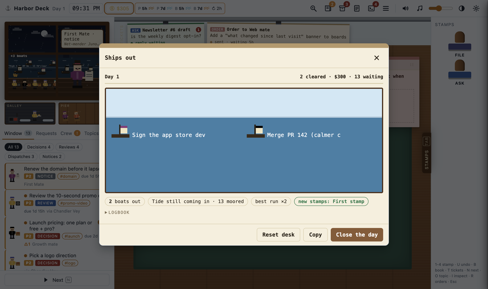

# Harbor Deck

A desktop desk for everything your agents need from you. Agents drop small JSON items into a folder; Harbor Deck turns them into paperwork at a harbor-office window: decisions to stamp, work to review, dispatches to read and file, notices only you can handle. Every stamp, question and new order goes back to the agents as one line of JSONL, the moment you make it.


The app is a live view, not an import: it watches the data directory, so new items, thread replies, crew state and stamina appear on the running desk without a restart or refresh.

| Part | Where | For |
|---|---|---|
| Desktop app (Electron) | [`app/`](app) | the person at the desk |
| Data contract + JSON Schemas | [`docs/CONTRACT.md`](docs/CONTRACT.md), [`schema/`](schema) | anyone writing or reading the files |
| Agent CLI `harbordeck` / `hd` (+ MCP server) | [`cli/`](cli) | agents: write items cheaply, read answers |
| Agent skill | [`skill/`](skill) | teaching any agent to use the desk |
| firstmate adapter | [`adapters/firstmate`](adapters/firstmate), setup in [`SETUP.md`](adapters/firstmate/SETUP.md) | a complete live integration: `install.sh` wires a firstmate home in one command |

## Install and run

Requires Node 18+ and macOS (Linux and Windows run from source too; packaging is set up for macOS first).

```sh
git clone https://github.com/Claire-Vu/HarborDeck.git && cd HarborDeck
npm install
npm run demo     # a full synthetic day, with a pretend agent that answers your asks
npm start        # your real data directory (~/.harbordeck by default)
```

Build a runnable `.app`:

```sh
npm run dist     # dist/mac-arm64/Harbor Deck.app (unsigned; right-click > Open the first time)
npm run dist:dmg # a .dmg instead
```

If `npm install` leaves Electron half-installed (`Electron failed to install correctly`), npm's script approval skipped Electron's download step: run `npm approve-scripts electron && npm rebuild electron`.

## Connect an agent

1. Start the app once (it creates `~/.harbordeck/items/`).
2. Install the CLI where the agent runs and teach the agent the skill: see [`cli/README.md`](cli/README.md).
3. The agent writes items (`hd decision ...`, `hd batch ...`) and reads your answers (`hd answers --cursor <name> --wait` blocks until you act).

Any agent that can write a JSON file can join without the CLI: the format is in [`docs/CONTRACT.md`](docs/CONTRACT.md).

## Data directory

`$HARBORDECK_HOME`, else the Settings field, else `~/.harbordeck/`:

```
~/.harbordeck/
  items/<id>.json   agent → app   one file per item; rewrite to update
  answers.jsonl     app → agent   append-only, one line per action
  gaps.jsonl        agent → app   responses that fit no item kind (listed in the Agent log drawer)
  notes.jsonl       agent → app   remarks kept with an existing item or topic (topic pages)
  fleet.json        optional      crew scene: who is cooking, waiting, idle
  quota.json        optional      stamina bars and refill countdowns
  rules.json        optional      standing orders that items are checked against
  scheduler.json    scheduler     queued work, next reset, keep-awake (docs/SCHEDULER.md)
  schedule/         scheduler     queue, history, config and log of the limit-reset scheduler
```

The app never writes items or snapshots, and agents never write `answers.jsonl`. Unreadable item files are skipped and listed in Settings; they never break the desk.

Artifact and body paths may be absolute, relative to the data directory, or (as a fallback) relative to the **Artifact root** setting. Local images, video, audio, PDFs, markdown and diffs are served to the window through a private `harbor://` protocol that only serves files referenced by current items. `http(s)` URLs open in your browser; PR and link artifacts render as cards. `web` and `lavish` artifacts on this machine (localhost, or a host listed in Settings → Web hosts) open in the desk's own browser pane with back, reload, open-in-browser and full-size controls, so a Lavish plan can be annotated without leaving the desk. The pane is a separate, sandboxed view with its own session: no bridge, no node, permissions denied, and off-machine links open in your browser.

## Answers

Each action is one line in `answers.jsonl`:

```json
{"id":"pr-142-checkout","action":"decide","key":"merge","note":"","at":1791448050}
{"id":"pricing-launch","action":"ask","note":"what does the free tier cost us at 1k users?","at":1791448071}
{"id":"req-1791448100-512","action":"request","note":"Add a dark theme","to":"mate-web","at":1791448100}
```

Stamps are held for about 4 seconds so **Undo** (`U`) can drop them; an undone stamp is never written, and closing the app flushes a held line. The full action list is in the contract.

### On-answer command

Settings → **On answer** runs a shell command after every line written to `answers.jsonl`, so an agent can be woken instantly instead of polling. Off by default.

- The line arrives on **stdin** (newline-terminated) and in `$HARBORDECK_LINE`; `$HARBORDECK_HOME` is the data directory; the working directory is the data directory.
- It runs through `/bin/sh -c` with a 30 s timeout. Failures are logged and never block the desk.

```sh
# examples
~/bin/wake-agent.sh                                   # your own doorbell script
tmux send-keys -t agent "answers waiting" Enter       # nudge an agent pane
```

Agents that run a loop can skip the hook and block on `hd answers --cursor <name> --wait` instead; [`adapters/firstmate/hd-live.sh`](adapters/firstmate) does exactly that.

## Queue work for after the usage reset

Out of stamina? On the ship phone, write the order and press `⌥Enter` or **Queue for after reset** (or pick a time and **Queue at time**). The order clips to the ticket rail as *waiting for reset · 2h 14m*, flips to *sent* when the scheduler hands it over, and to *replied* when the agent answers. The chip next to the stamina bars shows queued count, time to reset and, on macOS, how long the Mac is kept awake (`caffeinate -i`, display still sleeps). Withdraw a queued order from its ticket.

Delivery needs the scheduler job and a wake command once:

```sh
hd scheduler config --wake-command "<how to wake your agent>"
hd scheduler install            # launchd tick every 60 s (macOS); prints the Claude Code hook
```

Details, presets (generic, firstmate) and safety rules: [`docs/SCHEDULER.md`](docs/SCHEDULER.md).

## Settings

Open with ⌘, (or the gear icon). Stored in the app's user-data folder as `settings.json`.

| Setting | Default | Notes |
|---|---|---|
| Data directory | `~/.harbordeck` | `HARBORDECK_HOME` overrides it for the session |
| Artifact root | empty | extra base for relative artifact paths |
| Web hosts | empty | hosts besides localhost the browser pane may show (`host` or `host:port`) |
| Phone shortcut | `CommandOrControl+Shift+Space` | opens the ship phone in the app and from any other app (an Electron accelerator; empty: icon only). If another app holds it (1Password Quick Access defaults to ⇧⌘Space), Settings says so and it works inside Harbor Deck only |
| On answer | off | command run per answer line (above) |
| Demo | | load the synthetic demo day, or go back to your data |

Desk state that is not part of the contract (cash, day count, paper positions, read marks, preferences) lives in the app's local storage, per data directory. Harbor game state (owned cosmetics, stamp book, days at the desk) lives there too. **Ships out → Reset desk** clears it; `answers.jsonl` is never touched.

## Demo

`npm run demo` (or Settings → Load demo data, or File → Load Demo Data) seeds a separate demo directory inside the app's user-data folder with a synthetic day: 20 items across all four kinds (one task's three questions arrive as a question sheet), standing orders, a crew, stamina windows, a waiting order and an answered question, plus a synthetic plan page served from `127.0.0.1` for the browser pane. A pretend agent replies to your asks and orders and resolves stamped items through the same files, so the whole loop is visible. Your real data directory is never touched, and the demo is reseeded fresh on every launch.

## Using the desk

| Key | Does |
|---|---|
| `1`-`4` | stamp: Approve/File, Reject, Needs work, Ask (the last two open a note slip) |
| `Space` | stamp Approve/File (a question sheet: every ticked row); no Enter-to-stamp anywhere; on the morning manifest it opens the office |
| `A`-`E` | pick option A-E on a decision; on a question sheet, then move to the next row |
| `J` / `K` | next / previous row of a question sheet |
| `S` / `Shift+S` | Later: park the item (a sheet: every ticked row) until tomorrow 9:00 / just after the next usage reset; writes a `defer` line |
| `Shift+A` | take all recommended: a checklist of every P3-P4 decision with a recommendation; untick, then one stamp (Shift+A again) |
| `U` / `Z` | undo the last stamp (about 4 s) |
| `Tab` | slide the stamp tray in and out |
| `X` / `Shift+X` | stow the last-raised paper in the storage box (foot of the stamp tray) / bring all stowed papers back; also a stow button on each paper's grip or drag it onto the box; the stowed papers stand in the box as a pile; click it to see a small copy of each, click one to bring it back; per item, kept across reloads |
| `N` | next visitor at the window |
| `←` / `→` | flip the top window's scene: one per kind (Signpost Square, Customs Shed, Bottle Cove, Notice Board), a figure per open item; click a figure to bring it to the desk, a kind chip to jump; goal: zero everywhere |
| `T` | focus the ticket rail (`←`/`→`, `Enter`) |
| `I` | inspect: pair a claim with evidence, then Match or Mismatch (writes a `comment` with an anchor) |
| `R` | standing orders |
| `L` | ships out: today's recap (boats that sailed, the tide, new stamps; the full report as the logbook), close the day |
| `Shift+B` | chandlery and stamp book (also: click the cash chip) |
| `O` | topic page of the item at the desk |
| `P` | plain mode (a flat list with the same actions) |
| `⌘K` / `Ctrl+K` | search every item (open, parked and filed), topic and note; arrows move, `Enter` opens, `Esc` closes (also: Search in the menu) |
| `Esc` | close drawers and dialogs |
| `⇧⌘Space` | ship phone (see below; the key is a setting) |

Ship phone: the speaking tube in the top bar, or `⇧⌘Space` (Ctrl+Shift+Space elsewhere) from any app, brings a phone to the middle of the desk with the pad focused. Dial a first mate with `1`-`9` or the arrows (before you start typing; `⌘1`-`⌘9` any time), speak, `Enter` sends (`Shift+Enter` for a new line), `⌥Enter` queues it for after the usage reset, and a time plus **Queue at time** queues it for then. Sending writes one `request` line to `answers.jsonl`; it remembers who you dialed last, and hangs up with a check on the icon. `Esc` or the shortcut hangs up and keeps an unsent message. The system-wide shortcut is the only thing that ever brings the window forward.

Topics: every item carries a topic chip; its page shows what is still open and a timeline of the items, stamps, replies and agent notes on that subject (`O` opens the topic of the item at the desk, `⌘K` finds any topic). Items that share a topic or a `rel` link arrive as one visitor with one question sheet (a row per item, letter keys per row) and are settled with one stamp; agents number a task's questions `<task>.q1`, `.q2`, ... and the CLI gives them that topic. Options can carry a grey `why` line. The queue groups visitors in lanes by project, each with weight icons (quick call, report, PR, video); the speech bubble says the ask. Desk papers never overlap: the main artifact fills a reading column, and paths show as file names (hover for the full path). A local `.html` report opens in the browser pane with its own CSS and scripts. Parked (`Later`) items wait in a lane at the bottom of the queue and come back by themselves; click one to bring it back now.

What changed: when an agent rewrites an item you already looked at, its queue row says `updated` and the desk lights only what is new since your last look: the title (hover for the old one), new summary sentences, new or relabelled options, new papers, new replies and notes, and new lines of the report body. Leave the item and come back, and it is plain again. Who's waiting: a `⏸ N` badge on an item counts the workers paused until you answer it (the item's `waiting`, or crew in `fleet.json` waiting on it), and each one lifts it a priority step in the queue, so what unblocks work comes first.

The harbor in the window carries status, with no extra keys: one boat per open task (the sail grows with its question count; it sails out once settled), the project's own recurring regular at the window with a mood and a one-line memory of your recent calls, a ship cat sitting by the most urgent figure in the scene, sky and weather from the real clock and the lowest stamina (rain when low), and a tide line rising toward the next refill (the top bar keeps the refill times). Quick clearing stamps (within 8 s) build a tidy run with rising stamp and coin pitch; undo breaks it and bundle stamps never count. Clear the pier before high tide to beat the tide. Cash buys cosmetics at the chandlery (dock lamp, pennants, lighthouse, stamp inks, a second tune); milestones land as round ink stamps in the stamp book; the town on the far shore gains a building every two days you open the office; the harbor music adds a layer per item cleared today and resolves when the harbor is clear. All of it runs after the stamp lands; nothing waits on an animation.

The top bar keeps only status (day, clock, cash, usage left per window with reset countdowns, scheduler chip), the ship phone and one menu button (key `M`); search, standing orders, archive, ships out, agent log, chandlery, inspect, plain mode, sound, music and volume, theme and Settings live in that menu, each with its shortcut. A badge on the menu button flags orders needing attention.

Also: morning manifest, archive, agent log (the exact JSONL lines, copy/export, plus gaps), the crew at work in the galley and on the pier under the window, usage per subscription window in long form (click the usage chips), ship phone for new orders to an agent, desk sounds and generated harbor music (both off by default), light/dark/auto theme.

| | |
|---|---|
|  |  |
|  |  |
|  |  |
|  | |

## Development

```sh
npm test            # unit tests: data loading, answer writing, path resolution, hook, watcher, demo seed; then the garden gate
npm run test:smoke  # launches the real app with Playwright: render, stamp + undo, live updates, security, queue-for-reset, browser pane
npm run check       # syntax check of main, preload, renderer and the scheduler module
(cd cli && npm test)             # CLI + scheduler (parsing, claim/no-resend, retries, keep-awake, installer, wake presets)
adapters/firstmate/test/run.sh   # adapter + install.sh against a stub firstmate home
test/evidence/run.sh demo        # recorded proof of the live round trip (ystack evidence runner)
npm run test:roundtrip          # a real claude -p agent -> desk -> stamp -> bridge -> agent, timed per leg (needs claude)
```

Tests and verification run the app headless (`HARBORDECK_HEADLESS=1`: the window is never shown, focused or in the Dock, but still paints for screenshots and UI driving). Set `HARBORDECK_HEADLESS=0` to watch a run.

`npm run garden` runs the ystack garden gate (`.garden/`) when `~/.agents/skills/garden` is installed, and skips otherwise. It ratchets two rules: no new source files over 400 code lines (the renderer and the CLI dispatcher are grandfathered, so add features as new modules), and no generic module names (`utils`, `helpers`).

Layout: `app/main.js` (data directory, watcher, `harbor://` protocol, IPC, menu), `app/preload.js` (the only bridge; `contextIsolation` on, `nodeIntegration` off, sandboxed renderer), `app/lib/` (store, watch, hook, settings, and the browser pane: `web-pane.js` + `web-allow.js`), `app/renderer/` (the desk: plain HTML/CSS/JS, no framework), `app/demo/` (seed and pretend agent).

## Credits

Inspired by inspection-desk and management games. All art, names, copy, sounds and music here are original: the scene is CSS/SVG pixel art and the audio is synthesized on the spot with WebAudio. Demo content is invented.

## License

See [LICENSE](LICENSE).
