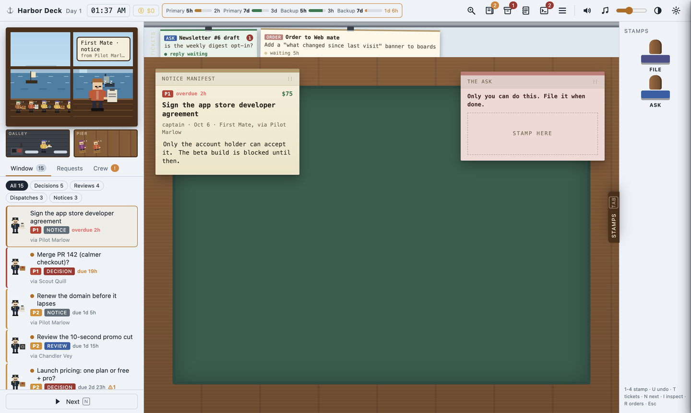
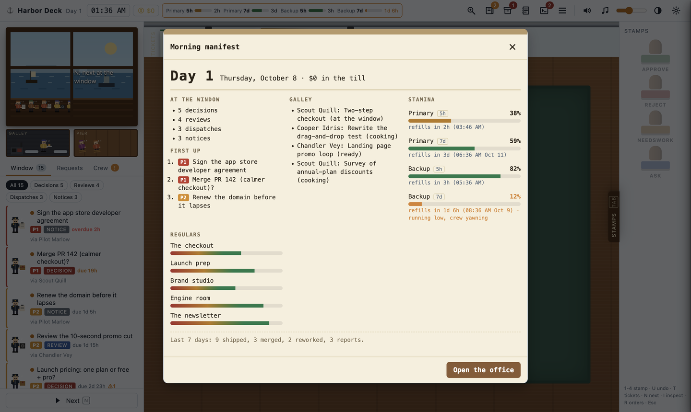
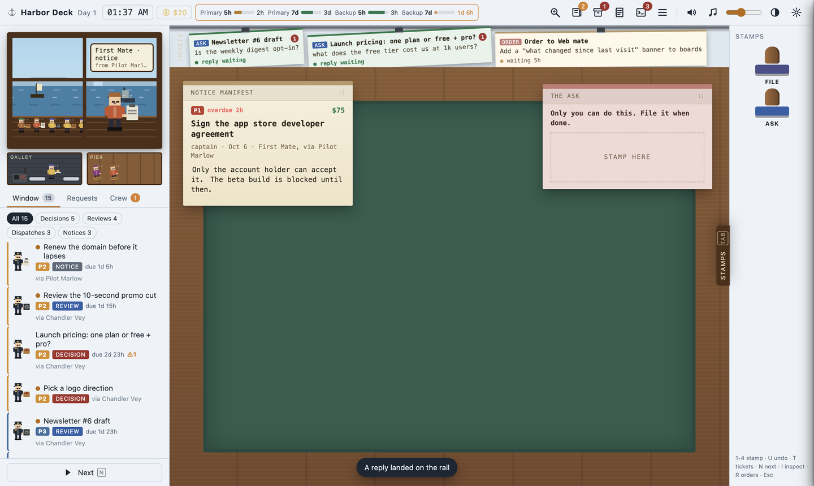
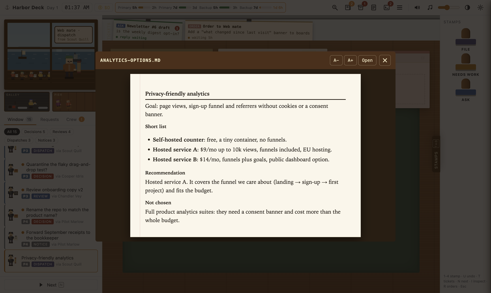
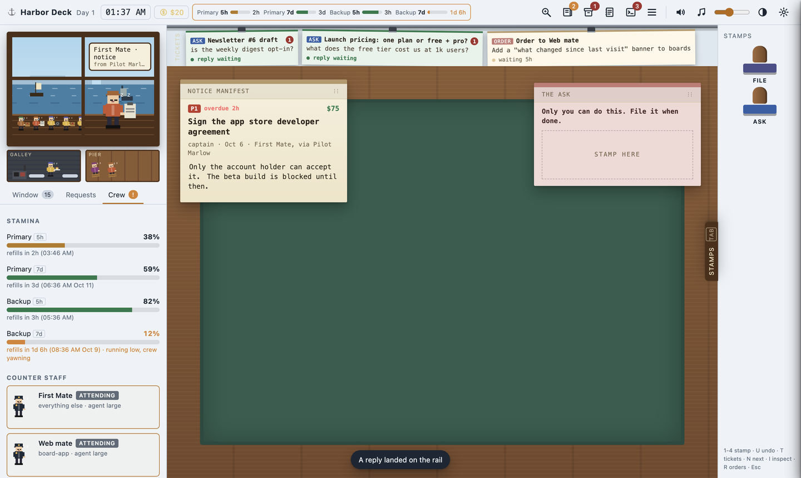
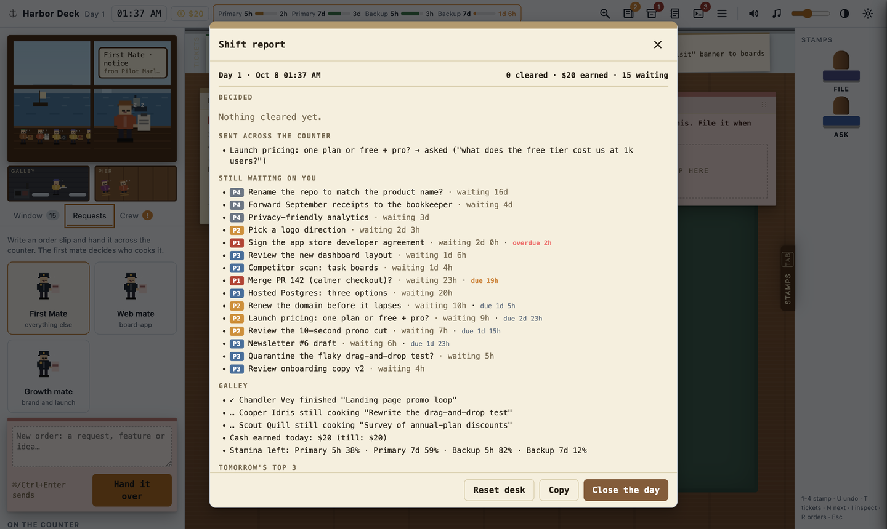
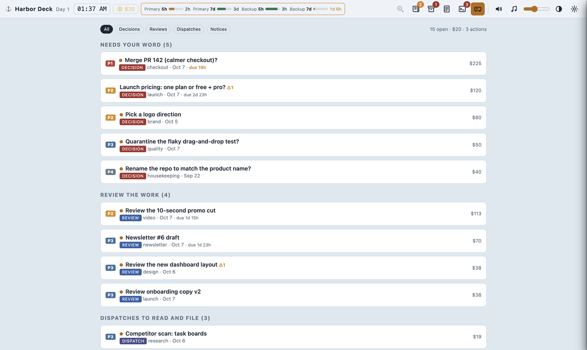
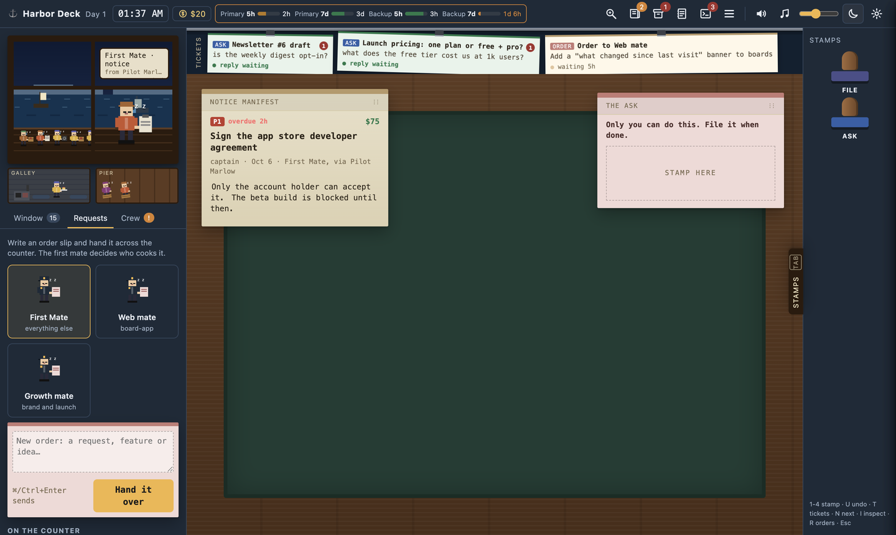

# Harbor Deck

A desktop desk for everything your agents need from you. Agents drop small JSON items into a folder; Harbor Deck turns them into paperwork at a harbor-office window: decisions to stamp, work to review, dispatches to read and file, notices only you can handle. Every stamp, question and new order goes back to the agents as one line of JSONL, the moment you make it.



The app is a live view, not an import: it watches the data directory, so new items, thread replies, crew state and stamina appear on the running desk without a restart or refresh.

| Part | Where | For |
|---|---|---|
| Desktop app (Electron) | [`app/`](app) | the person at the desk |
| Data contract + JSON Schemas | [`docs/CONTRACT.md`](docs/CONTRACT.md), [`schema/`](schema) | anyone writing or reading the files |
| Agent CLI `harbordeck` / `hd` (+ MCP server) | [`cli/`](cli) | agents: write items cheaply, read answers |
| Agent skill | [`skill/`](skill) | teaching any agent to use the desk |
| firstmate adapter | [`adapters/firstmate`](adapters/firstmate), setup in [`SETUP.md`](adapters/firstmate/SETUP.md) | a complete live integration: `install.sh` wires a firstmate home in one command |

## Install and run

Requires Node 18+ and macOS (Linux and Windows run from source too; packaging is set up for macOS first).

```sh
git clone https://github.com/Claire-Vu/HarborDeck.git && cd HarborDeck
npm install
npm run demo     # a full synthetic day, with a pretend agent that answers your asks
npm start        # your real data directory (~/.harbordeck by default)
```

Build a runnable `.app`:

```sh
npm run dist     # dist/mac-arm64/Harbor Deck.app (unsigned; right-click > Open the first time)
npm run dist:dmg # a .dmg instead
```

If `npm install` leaves Electron half-installed (`Electron failed to install correctly`), npm's script approval skipped Electron's download step: run `npm approve-scripts electron && npm rebuild electron`.

## Connect an agent

1. Start the app once (it creates `~/.harbordeck/items/`).
2. Install the CLI where the agent runs and teach the agent the skill: see [`cli/README.md`](cli/README.md).
3. The agent writes items (`hd decision ...`, `hd batch ...`) and reads your answers (`hd answers --cursor <name> --wait` blocks until you act).

Any agent that can write a JSON file can join without the CLI: the format is in [`docs/CONTRACT.md`](docs/CONTRACT.md).

## Data directory

`$HARBORDECK_HOME`, else the Settings field, else `~/.harbordeck/`:

```
~/.harbordeck/
  items/<id>.json   agent → app   one file per item; rewrite to update
  answers.jsonl     app → agent   append-only, one line per action
  gaps.jsonl        agent → app   responses that fit no item kind (listed in the Agent log drawer)
  notes.jsonl       agent → app   remarks kept with an existing item or topic (topic pages)
  fleet.json        optional      crew scene: who is cooking, waiting, idle
  quota.json        optional      stamina bars and refill countdowns
  rules.json        optional      standing orders that items are checked against
  scheduler.json    scheduler     queued work, next reset, keep-awake (docs/SCHEDULER.md)
  schedule/         scheduler     queue, history, config and log of the limit-reset scheduler
```

The app never writes items or snapshots, and agents never write `answers.jsonl`. Unreadable item files are skipped and listed in Settings; they never break the desk.

Artifact and body paths may be absolute, relative to the data directory, or (as a fallback) relative to the **Artifact root** setting. Local images, video, audio, PDFs, markdown and diffs are served to the window through a private `harbor://` protocol that only serves files referenced by current items. `http(s)` URLs open in your browser; PR and link artifacts render as cards. `web` and `lavish` artifacts on this machine (localhost, or a host listed in Settings → Web hosts) open in the desk's own browser pane with back, reload, open-in-browser and full-size controls, so a Lavish plan can be annotated without leaving the desk. The pane is a separate, sandboxed view with its own session: no bridge, no node, permissions denied, and off-machine links open in your browser.

## Answers

Each action is one line in `answers.jsonl`:

```json
{"id":"pr-142-checkout","action":"decide","key":"merge","note":"","at":1791448050}
{"id":"pricing-launch","action":"ask","note":"what does the free tier cost us at 1k users?","at":1791448071}
{"id":"req-1791448100-512","action":"request","note":"Add a dark theme","to":"mate-web","at":1791448100}
```

Stamps are held for about 4 seconds so **Undo** (`U`) can drop them; an undone stamp is never written, and closing the app flushes a held line. The full action list is in the contract.

### On-answer command

Settings → **On answer** runs a shell command after every line written to `answers.jsonl`, so an agent can be woken instantly instead of polling. Off by default.

- The line arrives on **stdin** (newline-terminated) and in `$HARBORDECK_LINE`; `$HARBORDECK_HOME` is the data directory; the working directory is the data directory.
- It runs through `/bin/sh -c` with a 30 s timeout. Failures are logged and never block the desk.

```sh
# examples
~/bin/wake-agent.sh                                   # your own doorbell script
tmux send-keys -t agent "answers waiting" Enter       # nudge an agent pane
```

Agents that run a loop can skip the hook and block on `hd answers --cursor <name> --wait` instead; [`adapters/firstmate/hd-live.sh`](adapters/firstmate) does exactly that.

## Queue work for after the usage reset

Out of stamina? In **Requests**, write the order and press **Queue for after reset** (or pick a time and **Queue at time**). The order clips to the ticket rail as *waiting for reset · 2h 14m*, flips to *sent* when the scheduler hands it over, and to *replied* when the agent answers. The chip next to the stamina bars shows queued count, time to reset and, on macOS, how long the Mac is kept awake (`caffeinate -i`, display still sleeps). Withdraw a queued order from its ticket.

Delivery needs the scheduler job and a wake command once:

```sh
hd scheduler config --wake-command "<how to wake your agent>"
hd scheduler install            # launchd tick every 60 s (macOS); prints the Claude Code hook
```

Details, presets (generic, firstmate) and safety rules: [`docs/SCHEDULER.md`](docs/SCHEDULER.md).

## Settings

Open with ⌘, (or the gear icon). Stored in the app's user-data folder as `settings.json`.

| Setting | Default | Notes |
|---|---|---|
| Data directory | `~/.harbordeck` | `HARBORDECK_HOME` overrides it for the session |
| Artifact root | empty | extra base for relative artifact paths |
| Web hosts | empty | hosts besides localhost the browser pane may show (`host` or `host:port`) |
| On answer | off | command run per answer line (above) |
| Demo | | load the synthetic demo day, or go back to your data |

Desk state that is not part of the contract (cash, day count, paper positions, read marks, preferences) lives in the app's local storage, per data directory. **Shift report → Reset desk** clears it; `answers.jsonl` is never touched.

## Demo

`npm run demo` (or Settings → Load demo data, or File → Load Demo Data) seeds a separate demo directory inside the app's user-data folder with a synthetic day: 17 items across all four kinds, standing orders, a crew, stamina windows, a waiting order and an answered question, plus a synthetic plan page served from `127.0.0.1` for the browser pane. A pretend agent replies to your asks and orders and resolves stamped items through the same files, so the whole loop is visible. Your real data directory is never touched, and the demo is reseeded fresh on every launch.

## Using the desk

| Key | Does |
|---|---|
| `1`-`4` | stamp: Approve/File, Reject, Needs work, Ask (the last two open a note slip) |
| `U` / `Z` | undo the last stamp (about 4 s) |
| `Tab` | slide the stamp tray in and out |
| `N` | next visitor at the window |
| `T` | focus the ticket rail (`←`/`→`, `Enter`) |
| `I` | inspect: pair a claim with evidence, then Match or Mismatch (writes a `comment` with an anchor) |
| `R` | standing orders |
| `L` | shift report |
| `O` | topic page of the item at the desk |
| `P` | plain mode (a flat list with the same actions) |
| `Esc` | close drawers and dialogs |

Topics: every item carries a topic chip; its page shows what is still open and a timeline of the items, stamps, replies and agent notes on that subject (Topics tab for the list). Items that share a topic or a `rel` link arrive as one visitor with a bundle of papers and can be settled with one stamp.

Also: morning manifest, archive, agent log (the exact JSONL lines, copy/export, plus gaps), crew tab with stamina per subscription window, requests tab for new orders to an agent, desk sounds and generated harbor music (both off by default), light/dark/auto theme.

| | |
|---|---|
|  |  |
|  |  |
|  |  |
|  | |

## Development

```sh
npm test            # unit tests: data loading, answer writing, path resolution, hook, watcher, demo seed; then the garden gate
npm run test:smoke  # launches the real app with Playwright: render, stamp + undo, live updates, security, queue-for-reset, browser pane
npm run check       # syntax check of main, preload, renderer and the scheduler module
(cd cli && npm test)             # CLI + scheduler (parsing, claim/no-resend, retries, keep-awake, installer, wake presets)
adapters/firstmate/test/run.sh   # adapter + install.sh against a stub firstmate home
test/evidence/run.sh demo        # recorded proof of the live round trip (ystack evidence runner)
```

Tests and verification run the app headless (`HARBORDECK_HEADLESS=1`: the window is never shown, focused or in the Dock, but still paints for screenshots and UI driving). Set `HARBORDECK_HEADLESS=0` to watch a run.

`npm run garden` runs the ystack garden gate (`.garden/`) when `~/.agents/skills/garden` is installed, and skips otherwise. It ratchets two rules: no new source files over 400 code lines (the renderer and the CLI dispatcher are grandfathered, so add features as new modules), and no generic module names (`utils`, `helpers`).

Layout: `app/main.js` (data directory, watcher, `harbor://` protocol, IPC, menu), `app/preload.js` (the only bridge; `contextIsolation` on, `nodeIntegration` off, sandboxed renderer), `app/lib/` (store, watch, hook, settings, and the browser pane: `web-pane.js` + `web-allow.js`), `app/renderer/` (the desk: plain HTML/CSS/JS, no framework), `app/demo/` (seed and pretend agent).

## Credits

Inspired by inspection-desk and management games. All art, names, copy, sounds and music here are original: the scene is CSS/SVG pixel art and the audio is synthesized on the spot with WebAudio. Demo content is invented.

## License

See [LICENSE](LICENSE).
