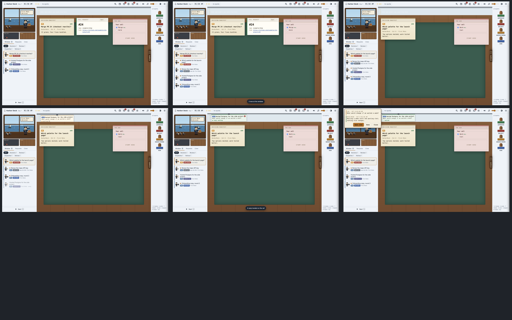

# Live-feed evidence

Recorded by `test/evidence/run.sh demo` with the ystack evidence runner: the real Electron app, with synthetic data and a stub firstmate home, and the bridge in echo mode.

1. Open the office.
2. An agent posts two items with one `harbordeck batch`, and they appear in the queue live.
3. Key `1` stamps a decision. After the undo hold, the line lands in `answers.jsonl`, and the bridge logs `printf 'ship-24\tmerge\tMerge\tdone' | fm-captain-hold.sh answers --source harbordeck`.
4. Key `4` sends an ask. It clips to the ticket rail, and the bridge logs `fm-inbox.sh note --request-id hd-db-research-ask-<at> -- ...`.
5. The agent runs `harbordeck reply`, and the ticket turns green.
6. The reply reads on the rail.

Video: [live-feed.mp4](live-feed.mp4)

## Verification skill proof run

`docs/evidence/verify-harbordeck/` is one run of the project's verification skill (`.cursor/skills/verify-harbordeck/`) on synthetic data: launch, doctor, an agent's `harbordeck decision` appearing live, key `1` writing `answers.jsonl` after the undo hold, an order queued for after reset in Requests, and `harbordeck tick` delivering it through the stub wake command, then cleanup. [`transcript.txt`](verify-harbordeck/transcript.txt) is the full command log with exit codes; the screenshots, `answers.jsonl` and `wake.log` are the captured state.
